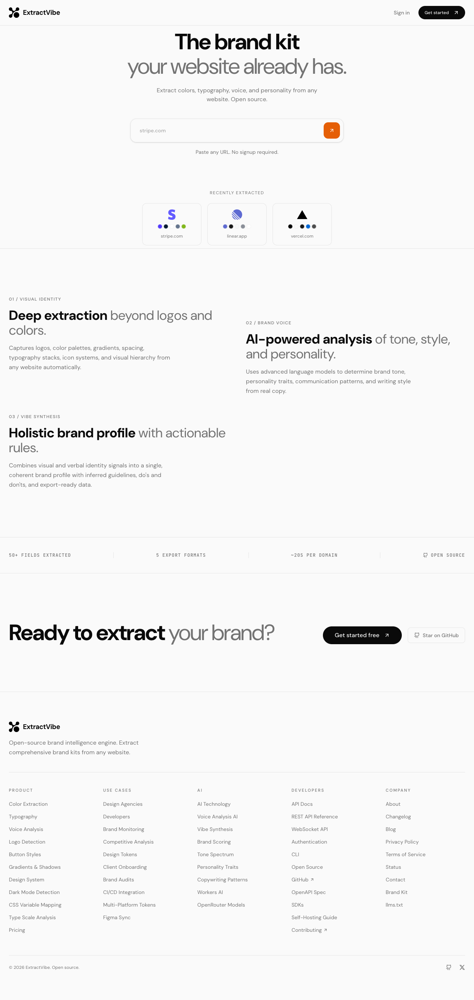
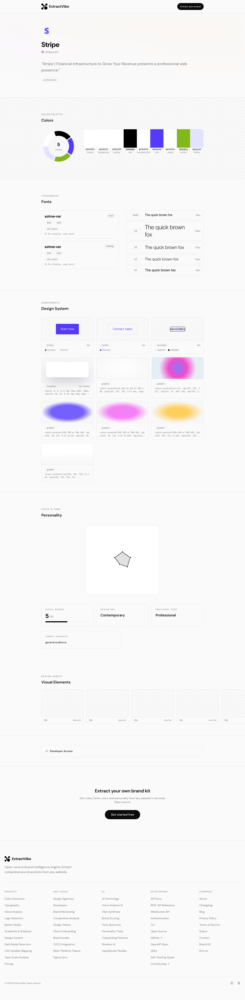

# ExtractVibe

> The brand kit your website already has.

An open-source brand extraction engine that pulls a full brand identity — logos, colors, typography, voice, personality, and actionable brand rules — from any URL. Not just assets. The full vibe.

[](LICENSE)
[](https://github.com/seangeng/extractvibe/actions/workflows/ci.yml)
[](https://developers.cloudflare.com/workers/)
[](https://extractvibe.com)



## What it does

ExtractVibe renders a target website using headless Chrome, parses the DOM and computed styles for visual identity data, then runs the extracted content through an LLM pipeline to analyze brand voice, synthesize a personality profile, and generate specific brand usage rules. Every extracted value carries a confidence score. The output is a single structured JSON object covering ~50 fields across 10 categories.



## Example Output

Condensed extraction for `stripe.com`:

```json
{
  "meta": {
    "domain": "stripe.com",
    "schemaVersion": "v1",
    "durationMs": 12400
  },
  "identity": {
    "brandName": "Stripe",
    "tagline": "Financial infrastructure for the internet",
    "archetypes": [{ "name": "The Creator", "confidence": 0.85 }]
  },
  "colors": {
    "lightMode": {
      "primary":    { "hex": "#635BFF", "role": "primary",    "confidence": 0.95 },
      "background": { "hex": "#FFFFFF", "role": "background", "confidence": 0.98 },
      "text":       { "hex": "#425466", "role": "text",       "confidence": 0.92 },
      "accent":     { "hex": "#00D4AA", "role": "accent",     "confidence": 0.88 }
    }
  },
  "typography": {
    "families": [
      { "name": "Inter", "role": "body", "source": "self-hosted", "weights": [400, 500, 600], "confidence": 0.96 },
      { "name": "Inter", "role": "heading", "weights": [600, 700], "confidence": 0.94 }
    ],
    "scale": {
      "h1": { "fontSize": "3.5rem", "fontWeight": 700, "lineHeight": "1.1", "letterSpacing": "-0.04em" },
      "h2": { "fontSize": "2.5rem", "fontWeight": 600, "lineHeight": "1.2", "letterSpacing": "-0.02em" },
      "body": { "fontSize": "1.125rem", "fontWeight": 400, "lineHeight": "1.6" }
    }
  },
  "voice": {
    "toneSpectrum": {
      "formalCasual": 4,
      "playfulSerious": 6,
      "technicalAccessible": 4,
      "enthusiasticMatterOfFact": 6
    },
    "copywritingStyle": {
      "avgSentenceLength": 14,
      "vocabularyComplexity": "moderate",
      "jargonUsage": "some",
      "ctaStyle": "Start now"
    }
  },
  "vibe": {
    "summary": "Minimal, confident, developer-first. Stripe communicates authority through restraint — muted colors, generous whitespace, precise typography.",
    "tags": ["minimal", "technical", "premium", "developer-first", "confident"],
    "visualEnergy": 3,
    "designEra": "contemporary-minimal",
    "comparableBrands": ["Linear", "Vercel", "Notion"],
    "confidence": 0.91
  },
  "rules": {
    "dos": [
      "Use sentence case for all headings",
      "Keep CTAs to 3 words or fewer ('Start now', 'Get started')",
      "Use #635BFF (brand purple) as the primary accent, never as a background fill",
      "Maintain generous whitespace — minimum 4rem between major sections"
    ],
    "donts": [
      "Don't use all-caps except for small labels and badges",
      "Avoid exclamation marks in body copy",
      "Don't pair the logo with custom iconography",
      "Never set body text below 16px"
    ],
    "source": "inferred"
  }
}
```

## Features

### Extraction
- Deep visual identity — logos (6 types), colors with semantic roles, light/dark mode palettes, full typography scale, spacing tokens
- AI-powered voice analysis — tone spectrum across 5 axes, copywriting style metrics, content pattern detection
- Brand personality synthesis — vibe summary, tags, visual energy score, comparable brands, design era classification
- Brand rules generation — specific DOs and DON'Ts that reference the brand's actual colors, fonts, and patterns
- Official brand kit page discovery — auto-crawls `/brand`, `/press`, `/media-kit` paths and merges official guidelines
- Confidence scoring on every extracted value (0-1)

### Export Formats
- JSON — full schema, the primary format
- CSS Variables — `:root` custom properties
- Tailwind CSS v4 — `@theme` block with design tokens
- Markdown — human-readable brand report
- W3C Design Tokens — interoperable with Figma, Style Dictionary, and design systems

### Infrastructure
- 5-step Cloudflare Workflow pipeline (fetch/render, parse visual, analyze voice, discover brand kit, synthesize vibe)
- Real-time extraction progress via WebSocket (Durable Objects)
- Browser Rendering for JS-heavy sites
- 30-day KV caching with stale-while-revalidate (background re-extraction after 7 days)
- Asset storage in R2
- Cron-triggered monthly credit resets

## Quick Start

### Cloud (hosted)

1. Visit [extractvibe.com](https://extractvibe.com)
2. Sign up — 500 free extractions per month
3. Enter a URL, get a brand kit

### Self-Host

**Prerequisites:** Node.js 18+, a [Cloudflare account](https://dash.cloudflare.com/sign-up) (Workers paid plan required for Browser Rendering and Durable Objects), and an [OpenRouter API key](https://openrouter.ai/).

```bash
# 1. Clone the repo
git clone https://github.com/seangeng/extractvibe.git
cd extractvibe

# 2. Install dependencies
npm install --legacy-peer-deps

# 3. Create Cloudflare resources
npx wrangler d1 create extractvibe-db
npx wrangler kv namespace create CACHE
npx wrangler r2 bucket create extractvibe-assets

# 4. Configure wrangler
#    Copy the example config and fill in the resource IDs from step 3
cp wrangler.example.jsonc wrangler.jsonc
#    Edit wrangler.jsonc:
#    - Set d1_databases[0].database_id to your D1 database ID
#    - Set kv_namespaces[0].id to your KV namespace ID
#    - Remove or update the routes section for your own domain

# 5. Set secrets
npx wrangler secret put BETTER_AUTH_SECRET       # min 32 characters
npx wrangler secret put BETTER_AUTH_URL           # your deployed URL, e.g. https://your-app.workers.dev
npx wrangler secret put OPENROUTER_API_KEY        # your OpenRouter API key

# 6. Run database migrations
npx wrangler d1 execute extractvibe-db --remote --file=server/db/migrations/0001_initial.sql

# 7. Deploy
npm run deploy
```

For local development:

```bash
cp .dev.vars.example .dev.vars    # fill in secrets
npm run dev                        # starts at localhost:5173
npm run test                       # verify everything works
```

## API

### Start an extraction

```bash
curl -X POST https://extractvibe.com/api/extract \
  -H "Content-Type: application/json" \
  -H "x-api-key: ev_..." \
  -d '{"url": "https://stripe.com"}'
```

Returns a `jobId` for polling or WebSocket progress.

### Get the result

```bash
curl https://extractvibe.com/api/extract/:jobId/result
```

### Export in a specific format

```bash
curl https://extractvibe.com/api/extract/:jobId/export/css
curl https://extractvibe.com/api/extract/:jobId/export/tailwind
curl https://extractvibe.com/api/extract/:jobId/export/markdown
curl https://extractvibe.com/api/extract/:jobId/export/tokens
```

Full API documentation: [extractvibe.com/docs](https://extractvibe.com/docs)

## Schema

The `ExtractVibeBrandKit` (v1) is the top-level output type. Every field except `meta` is optional — brands vary widely in what they expose.

| Section | Contents |
|---|---|
| `meta` | URL, domain, extraction timestamp, schema version, duration |
| `identity` | Brand name, tagline, description, brand archetypes with confidence |
| `logos[]` | Type (primary/secondary/wordmark/logomark/monochrome/favicon), format, variant (light/dark), dimensions |
| `colors` | `lightMode` and `darkMode` palettes with role-classified colors, semantic status colors, raw palette |
| `typography` | Font families (with role, source, weights), full type scale (h1-h6, body, small, caption), conventions |
| `spacing` | Base unit, border radius scale, container max-width, grid system |
| `assets[]` | Non-logo visual assets — patterns, illustrations, icons, hero images, social images |
| `voice` | Tone spectrum (5 axes, 1-10 scale), copywriting style metrics, content patterns, sample copy |
| `rules` | AI-inferred DOs and DON'Ts referencing the brand's actual values |
| `vibe` | Summary, tags, visual energy (1-10), design era, comparable brands, emotional tone |
| `officialGuidelines` | Discovered brand kit URL, whether an official kit exists, extracted guideline rules |

Full schema definition: [`server/schema/v1.ts`](server/schema/v1.ts)

## Tech Stack

| Layer | Technology |
|---|---|
| Runtime | Cloudflare Workers |
| Frontend | React Router v7 (SSR) |
| API | Hono |
| Auth | Better Auth |
| AI | Gemini 2.5 Flash via OpenRouter |
| Database | Cloudflare D1 (SQLite) |
| Cache | Cloudflare KV (30-day TTL, stale-while-revalidate) |
| Storage | Cloudflare R2 |
| Browser | Cloudflare Browser Rendering |
| Pipeline | Cloudflare Workflows (5-step) |
| Progress | Durable Objects (WebSocket) |
| Styling | Tailwind CSS v4 + shadcn/ui |

## Project Structure

```
extractvibe/
├── app/                          # React Router v7 frontend
│   ├── components/               # UI components (shadcn/ui)
│   ├── routes/                   # Page routes and loaders
│   ├── lib/                      # Client-side utilities
│   └── styles/                   # Tailwind CSS
├── server/
│   ├── api/                      # Hono API routes
│   ├── db/
│   │   └── migrations/           # D1 SQL migrations
│   ├── durable-objects/
│   │   └── job-progress.ts       # WebSocket progress tracking
│   ├── lib/
│   │   ├── auth.ts               # Better Auth config
│   │   ├── ai.ts                 # OpenRouter / LLM client
│   │   ├── export-formats.ts     # CSS, Tailwind, Markdown, Tokens generators
│   │   └── extractor/
│   │       ├── fetch-render.ts   # Step 1: Browser Rendering + HTML fetch
│   │       ├── parse-visual.ts   # Step 2: DOM/CSS parsing for visual identity
│   │       ├── analyze-voice.ts  # Step 3: LLM voice/tone analysis
│   │       ├── discover-brand-kit.ts  # Step 4: Brand kit page discovery
│   │       └── synthesize-vibe.ts     # Step 5: Vibe synthesis
│   ├── schema/
│   │   └── v1.ts                 # ExtractVibeBrandKit type definitions
│   └── workflows/
│       └── extract-brand.ts      # Cloudflare Workflow orchestrator
├── workers/
│   └── app.ts                    # Worker entrypoint
├── public/
│   └── llms.txt                  # LLM-readable project summary
├── wrangler.example.jsonc        # Cloudflare config template
└── package.json
```

## Competitors

| Capability | ExtractVibe | OpenBrand | Firecrawl | Brand.dev |
|---|---|---|---|---|
| Logos (multi-variant) | 6+ types | 1-2 | Primary only | Logo + variants |
| Colors (role-classified, light+dark) | Full palette | Dominant only | Good with roles | Some roles |
| Typography system | Full scale + conventions | None | Families + sizes | Basic |
| Spacing / layout tokens | Full system | None | Basic | None |
| Brand voice & tone | Deep (5-axis spectrum) | None | Basic traits | None |
| Brand rules (DOs/DON'Ts) | AI-inferred | None | None | None |
| Brand kit page discovery | Auto-discover + interpret | None | None | None |
| Vibe synthesis | Full profile | None | None | None |
| Confidence scores | Per-field | None | None | None |
| Export formats | JSON, CSS, Tailwind, MD, Tokens | JSON | JSON | JSON |
| Open source | Yes | Yes | No | No |
| Self-hostable | Yes | Yes | No | No |

## Contributing

See [CONTRIBUTING.md](CONTRIBUTING.md) for setup instructions, code style, and PR guidelines.

```bash
git clone https://github.com/seangeng/extractvibe.git
cd extractvibe
npm install --legacy-peer-deps
cp .dev.vars.example .dev.vars
npm run dev
```

## License

[MIT](LICENSE)
